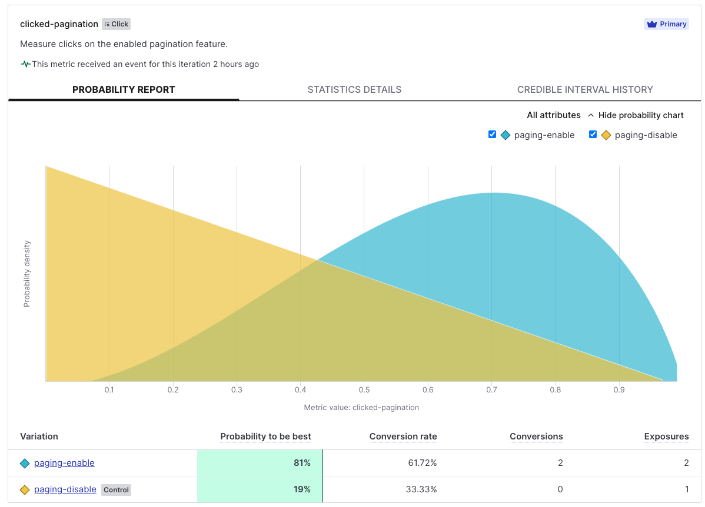

# LaunchDarkly Homework - Osborn

LD sample project to demonstrate some capabilities, complete the assignment, and have some fun.

# Table of Contents

- [Framework Description](#framework)
- [Olympic Results App](#olympic-results-app)
  - [User Accounts](#user-accounts)
- [Using the App](#using-the-app)
  - [Local Configuration](#configuration)
  - [Run the Application](#run-the-application)
  - [Notes](#environment-notes)
- [Technical Exercises](#technical-exercises)
  - [Part 1: Release and Remediate](#part-1-release-and-remediate)
  - [Part 2: Target](#part-2-target)
  - [Extra Credit: Experimentation](#extra-credit-experimentation)
  - [Extra Credit: Integrations](#extra-credit-integrations)

# Framework Description

I chose the following framework and tools for this application primarily because they can get you started
in just a few minutes.

* I did the work on a mac and using `brew` to install `java 21` and `gradle`
* I used IntelliJ as an IDE but, of course, you can use whatever you like
* [Spring Boot Initalizr](https://start.spring.io/) is so great to just download and go so that's what I did
* I picked`vue.js` as the front end because it can be run directly in the browser (without transpiler) and is enough to
  get this work done
* The data and authentication are both in-memory implementations for simplicity
* The default output from the `ldcli` is a string and I use [iTerm2](https://iterm2.com/) so I pipe the results through `jq` to format the output
* I apologize ahead of time for the keys and passwords pushed to git *(gulp)*

# Olympic Results App

I built a simple application that displays Olympic Medal data. Since the Olympics are super relevant at the moment,
customers are clicking more and more on the table. We've heard complaints of slowness. We believe the slowness
is due to the size of the table so server side pagination will help.

We used [LaunchDarkly](https://www.launchdarkly.com) to enable a new table that is paginated. We hope to improve the user
experience and reduce load on the database.

## User Accounts

The application is secured using a very basic framework. These are the users that are configured for each scenario.
When using the application, use the logins below when evaluating different scenarios.

| Login Name | Password | Groups         | Senario    |
|------------|----------|----------------|------------|
| jojo       | gold     | USER           | Part 1     |
| samone     | gold     | USER,QA_TESTER | Part 2     |
| skeet      | gold     | USER           | Part 2     |
| surfer     | gold     | USER,QA_TESTER | Part 2     |
| slater     | gold     | USER           | Experiment |
| lee        | gold     | USER           | Experiment |

# Using the App
The application should be started from a command line prompt. The following will detail how to get setup and
start the app.

## Configuration
These are the configuration steps required to get the application working.

I'm assuming you have access to a modern shell. I used `zsh` which is the default on a mac.
Make sure java and gradle are installed. I'm also assuming you know the basics of `gradle`.

```shell
brew update && brew upgrade
brew install java@21
brew install gradle
brew install jq
brew tap launchdarkly/homebrew-tap
brew install ldcli
```

Clone the repo and change directories to it. I'll assume you know what you are doing, so I'll ignore
directory names, etc.

```shell
git clone https://github.com/jonnio/launchdarkly-homework.git
cd launchdarkly-homework
```

The application needs at least `Java 21` so make sure you either have it setup by running
```shell
./gradlew --version
```

and verifying that the output is similar to this with at least Java 21.

```shell
------------------------------------------------------------
Gradle 8.8
------------------------------------------------------------

Build time:   2024-05-31 21:46:56 UTC
Revision:     4bd1b3d3fc3f31db5a26eecb416a165b8cc36082

Kotlin:       1.9.22
Groovy:       3.0.21
Ant:          Apache Ant(TM) version 1.10.13 compiled on January 4 2023
JVM:          21.0.4 (Homebrew 21.0.4)
OS:           Mac OS X 14.5 x86_64
```

If you have the incorrect version of java, you've installed the correct version using brew, and have
created the symlink (per brew instructions), ``export JAVA_HOME=`/usr/libexec/java_home -v 21` `` will usually get you
to the right place. Gradle will respect your `JAVA_HOME` environment variable.

### Run the application
Build and start the application from the command line. It is a [Spring Boot](https://spring.io/projects/spring-boot) app so 
we can easily start it using the gradle plugin that is already configured.

```shell
./gradlew clean bootRun
```

### Login and Logout
Navigate to [http://localhost:8080/](http://localhost:8080/) to login.

Click the `Logout` link in the upper right of the menu to [logout](http://localhost:8080/logout) of the application and change users.

### Environment Notes
* I used only the `proudction` environment per the instructions
* I did the configuration manually on the webpage but did experiment with doing it from a shell script
* Testing automation should be enabled
* I did _not_ have time to set up a `cypress` test suite for testing automation

# Technical Exercises
The technical exercises will require logging in as different users. It will also require the use of the `ldcli` to
turn a flag on and off. Configure the `ldcli` using the command line:
```shell
ldcli config --set access-token api-c66f6280-cda1-4149-9c44-6db333b9ac15
```
The token presented here will be removed after the evaluation period.

## Part 1: Release and Remediate
* Make sure the flag `feature-olympic-pagination` is disabled
* [Login](http://localhost:8080) to the application using the user `samone`. The user will be presented with a table of medals that has scrolling but no pagination. A user can simply sort by a column and scroll. 
* Enable the pagination feature and note that the screen updates with a pageable table interface.
```shell
ldcli flags --project default --environment production --flag feature-olympic-pagination toggle-on |jq -r '{name, kind, key, on: .environments.production.on}'
```
* Disable pagination by turning the flag off
```shell
ldcli flags --project default --environment production --flag feature-olympic-pagination toggle-off |jq -r '{name, kind, key, on: .environments.production.on}'
```
* Checkout the code for the client listener on line 185 in [index.html](src/main/resources/templates/index.html)
* Checkout the code for the server listener on line 30 in [LaunchDarklyConfiguration.java](src/main/java/ai/osborn/ld_homework/LaunchDarklyConfiguration.java). The server listener simply logs the event.

## Part 2: Target
Utilize the individual and rule based targeting by logging in as individual people.
Make sure the flag is enabled:
```shell
ldcli flags --project default --environment production --flag feature-olympic-pagination toggle-on |jq -r '{name, kind, key, on: .environments.production.on}'
```
### Individual Targeting
The user `jojo` will not have pagination. A target is configured so the user `skeet` does have pagination. 
* [Login](http://localhost:8080) as `jojo` and see that the pagination is not available 
* [Login](http://localhost:8080) as `skeet` and see that pagination is enabled

### Rule Targeting
A rule is configured such that any user with the role `QA_TESTER` will have pagination enabled.
* [Login](http://localhost:8080) as `surfer` or `samone` to see the pagination ([logout](http://localhost:8080/logout))
* [Login](http://localhost:8080) as `jojo` to see that pagination is not enabled ([logout](http://localhost:8080/logout))

## Extra Credit: Experimentation
I've added an experiment that tracks the clicks on the pagination buttons. The experiment uses a css filter to
track clicks on the buttons. Some sample results are in this screen shot:


## Extra Credit: Integrations
I created an integration between `LaunchDarkly` and my `GCP` account via `pub/sub` to store the events for
future analytics and reporting. (screenshot pending enablement of integrations)

